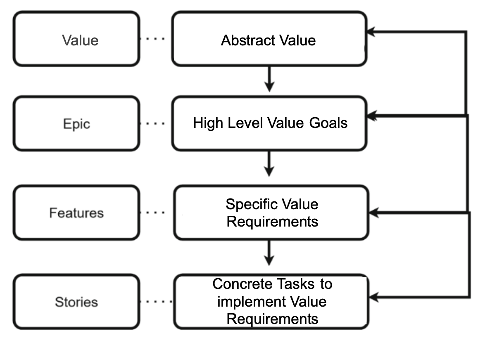

# Tech–Value Alignment Strategy

se this document throughout the project to connect identified stakeholder values with related requirements and technical work. Update it whenever new requirements or values are identified or when related design, implementation, testing, or stakeholder feedback changes.

**Tech–value alignment** is the process of connecting stakeholder values to technical artifacts—such as requirements, designs, code, and tests—and checking whether the resulting product supports those values.

This document records those connections, their validation, and changes made during development. Continue using the GitHub issue templates described in the **Requirements & Values Elicitation Guidelines**; do not duplicate complete issue records here.

### 1. Confirm the Value gitHub issue 
Confirm that each identified stakeholder value:

- has a separate GitHub Value issue
- contains the information required by the Value issue template

If a value has not yet been recorded, create its Value issue in GitHub before continuing, refer to **Requirements & Values Elicitation Guidelines** for assistance on how to record values in GitHub issues.

### 2. Connect values to technical artifacts 

Use the following hierarchy to connect stakeholder values to technical work:

Source: Adapted from [Agbese M. et al., 2025](https://link.springer.com/content/pdf/10.1007/978-3-032-14518-5_8.pdf)

Maintain the Following Hierarchy:

- One stakeholder **Value** must be linked to one or more **Epics**.
- One **Epic** may address one or more stakeholder **Values**.
- Each **Epic** should contain one or more **Features**.
- Each **Feature** should contain one or more **User Stories**.

  
### 2.1. Connect Each value to GitHub Epics and break down the work

For each stakeholder value:
1. Review the existing epics and identify which ones should address the value.
2. Link the Value issue to each relevant epic.
3. If no existing epic addresses the value, create a new epic using the **Epic** issue template
4. Break the epic down into appropriate features, user stories, and their sub tasks.
5. Use the appropriate Epic, Feature, User Story, or Task template in GitHub issues and complete all applicable fields.

## 3. Validation of Tech-Value Alignment
Ask relevant stakeholders or reviewers to confirm whether the technical artifacts support the intended stakeholder values. Validation may include reviewing requirements, designs, prototypes, demonstrations, implemented features, or test results.

### 5. Tech-Value Alignment submissions
At each required submission point:

- Export the value-related Epics and their linked Features, User Stories, and Tasks.
- Commit the export to the project repository as tech-value-alignment-export.csv or tech-value-alignment-export.md.
- Add the export date and a link below.

**Tech-Value Alignment export date:** [YYYY-MM-DD]  
**Tech-Value Alignment export:** [Add link]  
**Live GitHub Tech-Value Alignment view:** [Add link]

## Related Project Documents

1. **[Requirements and Values Elicitation Guidelines](https://github.com/inspireuvic/SENG480B-Fall2026/blob/main/requirements-values-documentation/requirements-values-elicitation-guidelines.md)**
2. **[Requirements and Values Document](https://github.com/inspireuvic/SENG480B-Fall2026/blob/main/requirements-values-documentation/requirements-values-documentation.md)**
3. **[Sprint Planning Document](https://github.com/inspireuvic/SENG480B-Fall2026/blob/main/sprint-documentation/sprint-planning.md)**
